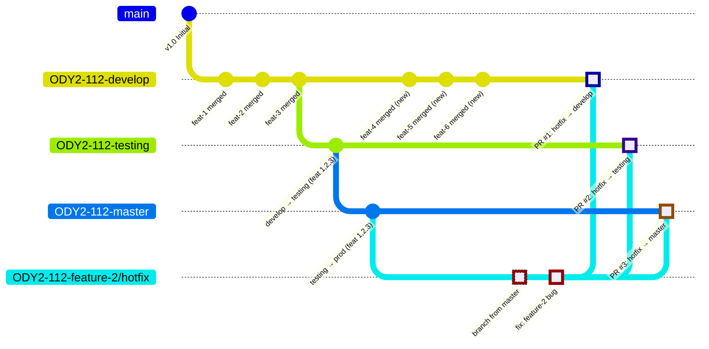
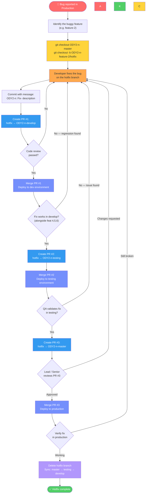
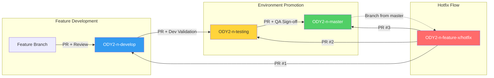

# Branching Workflow

This document defines the official Git branching strategy for all projects under **New Game Plus**. Every developer must follow this workflow to ensure consistent, reliable, and traceable deployments across environments.

---

## Table of Contents

1. [Branch Naming Convention](#branch-naming-convention)
2. [Environment Branches](#environment-branches)
3. [Feature Development Workflow](#feature-development-workflow)
4. [Hotfix Workflow](#hotfix-workflow)
5. [Diagrams](#diagrams)
6. [Rules & Guidelines](#rules--guidelines)
7. [Workflow Analysis & Concerns](#workflow-analysis--concerns)

---

## Branch Naming Convention

All branches **must** use the project prefix `ODY2` followed by the project/ticket number.

| Component | Format | Example |
|-----------|--------|---------|
| **Prefix** | `ODY2` | `ODY2` |
| **Project Number** | `-{number}` | `-112` |
| **Environment** | `-{env}` | `-develop`, `-testing`, `-master` |
| **Feature** | `-feature/{description}` | `-feature/optimizing-upload` |
| **Hotfix** | `-{feature-name}/hotfix` | `-feature-2/hotfix` |

> **Note:** The project number (e.g., `112`) is a variable tied to the Jira Epic or project. Replace it with the actual project number for your team.

### Full Branch Name Examples

```
ODY2-112-develop                          # Develop environment branch
ODY2-112-testing                          # Testing environment branch
ODY2-112-master                           # Production environment branch
ODY2-112-feature/optimizing-upload        # Feature branch
ODY2-112-feature-2/hotfix                 # Hotfix branch for feature-2
```

---

## Environment Branches

There are **three protected environment branches** per project:

```
┌─────────────────────────────────────────────────────────────────────┐
│                        Environment Branches                         │
├─────────────────────┬───────────────────┬───────────────────────────┤
│  ODY2-{n}-develop   │ ODY2-{n}-testing  │    ODY2-{n}-master        │
│                     │                   │                           │
│  • Integration      │ • QA / Staging    │  • Production             │
│  • Dev testing      │ • UAT             │  • Live releases          │
│  • Feature merges   │ • Pre-release     │  • Stable code only       │
└─────────────────────┴───────────────────┴───────────────────────────┘
```

| Branch | Purpose | Deploys To |
|--------|---------|------------|
| `ODY2-{n}-develop` | Integration branch where all feature branches are merged and dev-tested | Development environment |
| `ODY2-{n}-testing` | QA/Staging branch for formal testing before production | Testing/Staging environment |
| `ODY2-{n}-master` | Production branch — only thoroughly tested code lands here | Production environment |

> **Protected**: No direct commits to environment branches. All changes must go through Pull Requests.

---

## Feature Development Workflow

### Step-by-Step

```
Step 1: Create feature branch from develop
Step 2: Develop the feature
Step 3: PR → develop (code review required)
Step 4: Merge after approval → auto-deploy to dev environment
Step 5: PR → testing (after dev validation)
Step 6: Merge after QA approval → auto-deploy to testing environment
Step 7: PR → master (after testing sign-off)
Step 8: Merge → auto-deploy to production
```

### Detailed Flow

**1. Create a Feature Branch**

Branch off from `ODY2-{n}-develop`:

```bash
git checkout ODY2-112-develop
git pull origin ODY2-112-develop
git checkout -b ODY2-112-feature/optimizing-upload
```

**2. Develop & Commit**

Follow [commit message standards](ENGINEERING.md):

```bash
git commit -m "ODY2-112: Add- chunked upload for large files"
git commit -m "ODY2-112: Update- upload progress bar UI"
```

**3. Create PR → Develop**

```bash
gh pr create \
  --base ODY2-112-develop \
  --head ODY2-112-feature/optimizing-upload \
  --title "ODY2-112: Optimizing upload feature" \
  --body-file .github/PULL_REQUEST_TEMPLATE.md
```

- Another developer reviews the PR.
- Reviewer merges after approval.
- The feature is deployed and tested in the **development environment**.

**4. Promote to Testing**

After the feature is validated in develop:

```bash
gh pr create \
  --base ODY2-112-testing \
  --head ODY2-112-develop \
  --title "ODY2-112: Promote develop to testing" \
  --body-file .github/PULL_REQUEST_TEMPLATE.md
```

- QA team tests in the **testing environment**.
- Any issues found go back as new feature branches → develop.

**5. Promote to Production**

After testing sign-off:

```bash
gh pr create \
  --base ODY2-112-master \
  --head ODY2-112-testing \
  --title "ODY2-112: Release to production" \
  --body-file .github/PULL_REQUEST_TEMPLATE.md
```

- Final review by a lead/senior developer.
- Merge deploys to **production**.

### Feature Flow Diagram

```mermaid
gitGraph
    commit id: "Initial"
    branch ODY2-112-develop
    checkout ODY2-112-develop
    commit id: "develop base"

    branch ODY2-112-feature/feature-1
    checkout ODY2-112-feature/feature-1
    commit id: "feat-1 work"
    checkout ODY2-112-develop
    merge ODY2-112-feature/feature-1 id: "PR: feat-1 → develop" type: HIGHLIGHT

    branch ODY2-112-feature/feature-2
    checkout ODY2-112-feature/feature-2
    commit id: "feat-2 work"
    checkout ODY2-112-develop
    merge ODY2-112-feature/feature-2 id: "PR: feat-2 → develop" type: HIGHLIGHT

    branch ODY2-112-feature/feature-3
    checkout ODY2-112-feature/feature-3
    commit id: "feat-3 work"
    checkout ODY2-112-develop
    merge ODY2-112-feature/feature-3 id: "PR: feat-3 → develop" type: HIGHLIGHT

    branch ODY2-112-testing
    checkout ODY2-112-testing
    merge ODY2-112-develop id: "PR: develop → testing" type: HIGHLIGHT

    branch ODY2-112-master
    checkout ODY2-112-master
    merge ODY2-112-testing id: "PR: testing → master" type: HIGHLIGHT
```

---

## Hotfix Workflow

When a **critical bug is found in production**, the hotfix workflow bypasses the normal promotion chain to deliver a targeted fix to all environments.

### Scenario

| Environment | Contains |
|-------------|----------|
| `ODY2-112-master` (Production) | feature-1, feature-2, feature-3 |
| `ODY2-112-testing` (Testing) | feature-1, feature-2, feature-3 |
| `ODY2-112-develop` (Develop) | feature-1, feature-2, feature-3, feature-4, feature-5, feature-6 |

**Problem:** `feature-2` has a bug in production.

> **Why not promote through develop → testing → master?**
> Because develop contains feature-4, feature-5, feature-6 which are **not yet tested**. Promoting develop would push untested features into testing and production. The hotfix must be **isolated**.

### Step-by-Step

```
Step 1: Create hotfix branch FROM master (clean production state)
Step 2: Fix the bug
Step 3: PR → develop (validate fix alongside new features)
Step 4: PR → testing (deploy ONLY the fix to testing)
Step 5: PR → master (deploy ONLY the fix to production)
```

### Detailed Flow

**1. Create Hotfix Branch from Master**

```bash
git checkout ODY2-112-master
git pull origin ODY2-112-master
git checkout -b ODY2-112-feature-2/hotfix
```

**2. Fix the Bug & Commit**

```bash
git commit -m "ODY2-112: Fix- resolve upload crash in feature-2"
```

**3. PR → Develop (Validation)**

```bash
gh pr create \
  --base ODY2-112-develop \
  --head ODY2-112-feature-2/hotfix \
  --title "ODY2-112: Hotfix feature-2 → develop" \
  --body-file .github/PULL_REQUEST_TEMPLATE.md
```

- Verify the fix works in develop (which also has feature-4, 5, 6).
- Ensure no regressions.

**4. PR → Testing (Isolated Fix)**

```bash
gh pr create \
  --base ODY2-112-testing \
  --head ODY2-112-feature-2/hotfix \
  --title "ODY2-112: Hotfix feature-2 → testing" \
  --body-file .github/PULL_REQUEST_TEMPLATE.md
```

- QA verifies the fix in the testing environment.
- Testing only receives the hotfix — **not** feature-4, 5, 6.

**5. PR → Master (Production Fix)**

```bash
gh pr create \
  --base ODY2-112-master \
  --head ODY2-112-feature-2/hotfix \
  --title "ODY2-112: Hotfix feature-2 → master" \
  --body-file .github/PULL_REQUEST_TEMPLATE.md
```

- Lead/senior developer reviews.
- Merge deploys the fix to production.

### Hotfix Flow Diagram

This diagram shows the **state of each branch before and after** the hotfix. Read top-to-bottom to follow the timeline.



**Reading the diagram above:**

| Phase | What happens |
|-------|-------------|
| Commits 1–3 on develop | feature-1, 2, 3 are developed and merged into develop |
| Promotion to testing | All 3 features promoted to testing via PR |
| Promotion to master | All 3 features promoted to production via PR |
| Commits on develop | feature-4, 5, 6 are merged into develop (not yet in testing/master) |
| **Hotfix branch created** | **Branched from master** — contains only feat 1, 2, 3 (clean prod state) |
| Fix committed | Bug in feature-2 is fixed on the hotfix branch |
| **PR #1** → develop | Hotfix merged into develop (now has feat 1–6 + fix) |
| **PR #2** → testing | Hotfix merged into testing (now has feat 1–3 + fix, **not** 4–6) |
| **PR #3** → master | Hotfix merged into production (now has feat 1–3 + fix, **not** 4–6) |

### Hotfix Process Flowchart

Step-by-step decision flow showing **who does what** and **what happens on failure**.



---

## Overall Workflow Overview



---

## Rules & Guidelines

### Branch Rules

| Rule | Description |
|------|-------------|
| **No direct commits** | All environment branches (`develop`, `testing`, `master`) are protected. Changes go through PRs only. |
| **PR review required** | At least one reviewer must approve before merging into any environment branch. |
| **Use the PR template** | Every PR must follow the [PR Template](../PULL_REQUEST_TEMPLATE.md). |
| **Follow naming convention** | Branch names must follow `ODY2-{project}-{type}` format exactly. |
| **Commit message format** | Follow imperative mood with Jira ID: `ODY2-112: Fix- description`. See [Engineering Standards](ENGINEERING.md). |

### Promotion Rules

| From | To | Condition |
|------|----|-----------|
| Feature branch | `develop` | Code review approved by at least 1 developer |
| `develop` | `testing` | All features in develop are dev-validated |
| `testing` | `master` | QA sign-off and lead approval |
| Hotfix branch | `develop` | Code review + fix verified in dev environment |
| Hotfix branch | `testing` | Fix verified in develop, QA validates in testing |
| Hotfix branch | `master` | Fix verified in both develop and testing, lead approval |

### Do's and Don'ts

**Do:**
- Always pull the latest changes before creating a new branch.
- Create feature branches from `develop`, hotfix branches from `master`.
- Delete feature/hotfix branches after they are fully merged to all target environments.
- Communicate in the PR description _why_ the change is needed.

**Don't:**
- Never push directly to `develop`, `testing`, or `master`.
- Never promote `develop → testing` if develop contains unvalidated features.
- Never promote `testing → master` without QA sign-off.
- Never create a hotfix branch from `develop` — always from `master`.

---

## Workflow Analysis & Concerns

The following are identified concerns and recommendations for the team to consider:

### 1. Hotfix Branch Naming Clarity

**Issue:** The hotfix branch name should clearly reference the **feature that has the bug**, not an unrelated feature. If `feature-2` has a bug, the hotfix branch should be `ODY2-112-feature-2/hotfix`, not `ODY2-112-feature-3/hotfix`.

**Recommendation:** Always name hotfix branches after the buggy feature:
```
ODY2-{project}-{buggy-feature}/hotfix
```

---

### 2. Merge Conflict Risk After Hotfix

**Issue:** After a hotfix is merged into all three environments independently (develop, testing, master), future promotions (`develop → testing`, `testing → master`) may encounter **merge conflicts** because the same changes exist in different branches via different merge paths.

**Recommendation:**
- After completing a hotfix cycle, do a **sync merge** from `master → testing → develop` to ensure all branches have the same base state.
- Resolve any conflicts immediately after the hotfix cycle, not later.

---

### 3. No Rollback Strategy Defined

**Issue:** The workflow does not define what happens if a deployment to production causes issues and the hotfix cannot be applied quickly.

**Recommendation:** Define a rollback procedure:
- Use `git revert` on the merge commit in `master` to undo the problematic release.
- Or maintain tagged releases so you can redeploy a previous known-good state.

---

### 4. Develop Branch Contamination During Hotfix

**Issue:** When the hotfix is merged into `develop`, it mixes with feature-4, 5, 6 (which are still in development). If the hotfix introduces any side effects, it may be harder to isolate in develop.

**Recommendation:** The current approach of merging hotfix → develop is correct (keeps develop in sync), but the team should run regression tests in develop after the hotfix merge to catch any interaction issues early.

---

### 5. Missing CI/CD Gate Enforcement

**Issue:** The workflow relies on human discipline for promotions. Without automated gates, an untested feature could accidentally be promoted.

**Recommendation:** Set up branch protection rules and CI/CD pipelines:
- Require passing CI checks before any PR can be merged.
- Require status checks from the target environment's test suite.
- Use GitHub branch protection rules to enforce review requirements.

---

### 6. Environment Drift

**Issue:** Over time, the three environment branches can drift apart (especially if hotfixes are applied directly). This makes future merges harder.

**Recommendation:** Periodically verify that `master` is a subset of `testing`, and `testing` is a subset of `develop`. If drift is detected, perform sync merges:
```bash
# Sync master changes into testing
git checkout ODY2-112-testing
git merge ODY2-112-master

# Sync testing changes into develop
git checkout ODY2-112-develop
git merge ODY2-112-testing
```

---

## Quick Reference Card

```
FEATURE WORKFLOW:
  develop ← feature-branch ← (your code)
  testing ← develop
  master  ← testing

HOTFIX WORKFLOW:
  master → hotfix-branch ← (your fix)
  develop ← hotfix-branch
  testing ← hotfix-branch
  master  ← hotfix-branch

BRANCH FORMAT:
  Environment:  ODY2-{project}-{develop|testing|master}
  Feature:      ODY2-{project}-feature/{description}
  Hotfix:       ODY2-{project}-{feature-name}/hotfix

PR DIRECTION:
  feature → develop → testing → master  (normal)
  hotfix → develop, testing, master     (parallel, from master)
```
